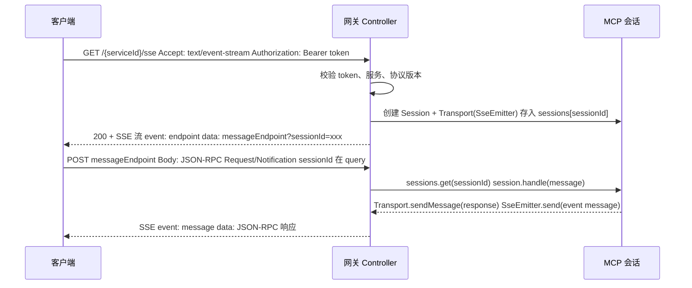
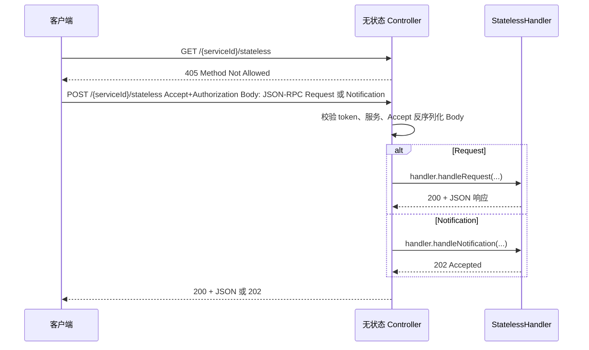

# 深入拆解MCP协议到MCP网关设计思路

> 本文介绍自研 MCP 网关的研发思路：在网关侧如何实现 MCP 的两种传输形态（有状态 SSE 与无状态 HTTP），如何借鉴官方 Java SDK 的传输层实现，以及为何推荐采用“自研 Controller + 复用 SDK 协议层”而非直接使用 SDK 的 Servlet 提供能力。

---

之前的文章 [Spring AI+MCP实战：零代码改造将传统服务接入大模型生态](https://mp.weixin.qq.com/s/Bvn2IVuAQNrhssiFSSMTNQ) 介绍了如何使用Spring AI简单几行代码将传统服务接入大模型，但有没有更简单的方式统一管理业务接口然后组合各个业务系统接口并一键发布为MCP服务呢，接下来我们就从MCP协议入手介绍MCP网关的设计思路。

## 一、MCP 协议与传输层简述

**MCP（Model Context Protocol）** 是一套用于客户端与“模型上下文”服务之间通信的协议，基于 **JSON-RPC 2.0**：请求（Request）需要响应，通知（Notification）不需要响应。传输层负责把 JSON-RPC 消息在 HTTP 上承载，常见有三种形态：

1. **有状态 SSE（Server-Sent Events）**：先通过 GET 建立一条长连接（SSE 流），服务端返回一个“消息端点” URL，客户端后续通过 POST 到该端点发送消息；服务端通过 SSE 向客户端推送响应或通知。
2. **无状态 Streamable HTTP**：不维护会话，每次请求都是独立的 POST；若为 Request 则响应 200 + JSON，若为 Notification 则响应 202 Accepted。规范要求 `Accept` 头同时包含 `application/json` 和 `text/event-stream`。
3. **Streamable HTTP（单端点 + Session）**：同一 URL 支持 GET / POST / DELETE。POST 的 `initialize` 会创建 Session 并返回 `MCP-Session-Id`；后续 POST 带该头处理消息，GET 带该头可建立 SSE 流（支持 `Last-Event-ID` 恢复）；DELETE 用于结束 Session。

### 1.1 MCP 消息中的 method

每条 JSON-RPC 消息都带有 `method` 字段，用于标识请求或通知的类型。下表以 **2025-11-25** 规范为准：[https://github.com/modelcontextprotocol/modelcontextprotocol/blob/main/schema/2025-11-25/schema.json](https://github.com/modelcontextprotocol/modelcontextprotocol/blob/main/schema/2025-11-25/schema.json)。

**客户端 → 服务端（Request，需响应）**

| method | 说明 |
|--------|------|
| `initialize` | 建连时首条请求，协商协议版本与能力 |
| `ping` | 保活探测 |
| `resources/list` | 列出服务端可读资源（支持分页 cursor） |
| `resources/templates/list` | 列出资源模板 |
| `resources/read` | 按 URI 读取资源内容 |
| `resources/subscribe` | 订阅资源变更通知 |
| `resources/unsubscribe` | 取消资源订阅 |
| `prompts/list` | 列出提示词/模板 |
| `prompts/get` | 获取指定提示词内容 |
| `tools/list` | 列出服务端提供的工具 |
| `tools/call` | 调用指定工具（可带 task 参数做异步任务） |
| `tasks/get` | 查询任务状态 |
| `tasks/result` | 获取任务结果负载 |
| `tasks/cancel` | 取消任务（替代对任务的 notifications/cancelled） |
| `tasks/list` | 分页列出任务 |
| `logging/setLevel` | 设置服务端日志级别 |
| `completion/complete` | 请求补全建议（如提示词/资源模板参数补全） |

**客户端 → 服务端（Notification，无响应）**

| method | 说明 |
|--------|------|
| `notifications/initialized` | 初始化完成后通知服务端 |
| `notifications/cancelled` | 取消某条已发出的请求（不含 task，task 用 tasks/cancel） |
| `notifications/progress` | 进度通知（与请求中的 progressToken 关联） |
| `notifications/tasks/status` | 任务状态变更通知（可选） |
| `notifications/roots/list_changed` | 客户端根目录列表变更通知 |

**服务端 → 客户端（Request，需响应）**

| method | 说明 |
|--------|------|
| `ping` | 保活探测 |
| `roots/list` | 向客户端请求根目录/根 URI 列表 |
| `sampling/createMessage` | 请求客户端代为调用 LLM 生成消息（可带 task 做异步） |
| `elicitation/create` | 服务端通过客户端向用户征集信息（表单或 URL） |
| `tasks/get` | 查询任务状态 |
| `tasks/result` | 获取任务结果负载 |
| `tasks/cancel` | 取消任务 |
| `tasks/list` | 分页列出任务 |

**服务端 → 客户端（Notification，无响应）**

| method | 说明 |
|--------|------|
| `notifications/message` | 日志消息（logging） |
| `notifications/progress` | 进度通知 |
| `notifications/cancelled` | 取消某条请求（不含 task） |
| `notifications/resources/list_changed` | 资源列表变更 |
| `notifications/resources/updated` | 某资源内容更新（需先 subscribe） |
| `notifications/prompts/list_changed` | 提示词列表变更 |
| `notifications/tools/list_changed` | 工具列表变更 |
| `notifications/tasks/status` | 任务状态变更通知（可选） |
| `notifications/elicitation/complete` | 服务端告知某次 elicitation 已完成 |

网关在实现时只需按 JSON-RPC 解析 `method` 并路由到对应Method的Handler实现；协议层可复用 SDK 的 `McpSchema` 与 Session/StatelessHandler，无需为每个 method 单独实现传输逻辑。

---

## 二、有状态 SSE 传输的研发思路

### 2.1 整体流程

网关研发时，有状态 SSE 采用“建连”与“发消息”分离的两个端点：



- **GET**：只负责建连与下发“消息端点”；Session 在服务端用 `sessionId` 标识，并在内存中维护。
- **POST 到消息端点**：从 query 取 `sessionId`，找到对应 Session，反序列化 body 为 JSON-RPC 消息，交给 `session.handle(message)`；若有响应，通过同一 Session 的 Transport（例如封装了 `SseEmitter`）以 SSE 的 `message` 事件推回客户端。

### 2.2 SDK 实现与核心代码：HttpServletSseServerTransportProvider

研发时参考官方 Java SDK 的 `HttpServletSseServerTransportProvider`（`mcp-core`）：SDK 用同一 Servlet 通过 **URI 区分** 建连与消息端点，单端点、单 Session 工厂，不区分服务/租户、不做 Bearer 校验。网关在实现时沿用该思路，并在入口层增加按 `serviceId` 和 token 校验。SDK 核心逻辑如下，供对照。

**建连（GET）** — `doGet`

```java
@Override
protected void doGet(HttpServletRequest request, HttpServletResponse response) throws ... {
    // ... URI 校验、isClosing 等
    response.setContentType("text/event-stream");
    response.setCharacterEncoding(UTF_8);
    response.setHeader("Cache-Control", "no-cache");
    response.setHeader("Connection", "keep-alive");

    String sessionId = UUID.randomUUID().toString();
    AsyncContext asyncContext = request.startAsync();
    asyncContext.setTimeout(0);
    PrintWriter writer = response.getWriter();

    HttpServletMcpSessionTransport sessionTransport = new HttpServletMcpSessionTransport(sessionId, asyncContext, writer);
    McpServerSession session = sessionFactory.create(sessionTransport);
    this.sessions.put(sessionId, session);

    this.sendEvent(writer, ENDPOINT_EVENT_TYPE, buildEndpointUrl(sessionId));
}

private String buildEndpointUrl(String sessionId) {
    return this.baseUrl + this.messageEndpoint + "?sessionId=" + sessionId;  // 或 baseUrl 末尾去斜杠拼接
}
```

**收消息（POST messageEndpoint）** — `doPost`

```java
@Override
protected void doPost(HttpServletRequest request, HttpServletResponse response) throws ... {
    // ... isClosing、URI 校验
    String sessionId = request.getParameter("sessionId");
    if (sessionId == null) { /* 400 + McpError */ return; }

    McpServerSession session = sessions.get(sessionId);
    if (session == null) { /* 404 + McpError */ return; }

    // 读取 body
    StringBuilder body = new StringBuilder();
    while ((line = reader.readLine()) != null) { body.append(line); }

    McpTransportContext transportContext = this.contextExtractor.extract(request);
    McpSchema.JSONRPCMessage message = McpSchema.deserializeJsonRpcMessage(jsonMapper, body.toString());

    session.handle(message).contextWrite(ctx -> ctx.put(McpTransportContext.KEY, transportContext)).block();
    response.setStatus(HttpServletResponse.SC_OK);
}
```

**Transport 职责** — 内部类 `HttpServletMcpSessionTransport`

```java
@Override
public Mono<Void> sendMessage(McpSchema.JSONRPCMessage message) {
    return Mono.fromRunnable(() -> {
        try {
            String jsonText = jsonMapper.writeValueAsString(message);
            sendEvent(writer, MESSAGE_EVENT_TYPE, jsonText);  // event: message \n data: <json>
        } catch (Exception e) {
            sessions.remove(sessionId);
            asyncContext.complete();
        }
    });
}

private void sendEvent(PrintWriter writer, String eventType, String data) throws IOException {
    writer.write("event: " + eventType + "\n");
    writer.write("data: " + data + "\n\n");
    writer.flush();
}

@Override
public Mono<Void> closeGracefully() {
    return Mono.fromRunnable(() -> {
        sessions.remove(sessionId);
        asyncContext.complete();
    });
}
```

研发思路：协议层（Session、JSON-RPC 路由）与传输层（SSE、HTTP）分离——Session 与业务逻辑复用 SDK 的 `McpServerSession`，网关只实现“按 serviceId + token 校验”的入口与基于 Spring `SseEmitter` 的 Transport，不重复造轮子。

**SDK 另一种有状态实现**：`HttpServletStreamableServerTransportProvider` 采用 Streamable HTTP 单端点 + Session：同一 URL 支持 GET / POST / DELETE；POST 的 `initialize` 创建 Session 并返回 `MCP-Session-Id`，后续 POST 带 `mcp-session-id` 头处理消息，GET 带该头可建立 SSE 流（支持 `Last-Event-ID` 恢复），DELETE 结束 Session。仍是单端点、单工厂、无按服务/租户的路由与鉴权。

---

## 三、无状态传输的研发思路

### 3.1 整体流程

网关采用无状态模式：不维护 Session，每次 POST 独立处理：



- **GET**：直接返回 405，表示该端点不支持“建连”。
- **POST**：  
  - 校验 `Accept` 必须同时包含 `application/json` 和 `text/event-stream`（与规范一致）。  
  - 若为 **Request**：调用无状态 Handler 的 `handleRequest`，将返回的 `JSONRPCResponse` 序列化后 200 写出。  
  - 若为 **Notification**：调用 `handleNotification`，返回 202 Accepted，无 body。

无状态不保存任何会话，无需 Session ID 与内存 Map，便于网关水平扩展，是自研网关的推荐默认形态。

### 3.2 SDK 实现与核心代码：HttpServletStatelessServerTransport

研发时参考官方 Java SDK 的 `HttpServletStatelessServerTransport`（`mcp-core`）：SDK 仅处理 POST、GET 返回 405，端点固定、无 `serviceId` 路由、无内置认证。网关在实现时沿用该逻辑，在入口增加按 `serviceId` 和 token 校验。SDK 核心逻辑如下，供对照。

**GET** — `doGet`

```java
@Override
protected void doGet(HttpServletRequest request, HttpServletResponse response) throws ... {
    if (!requestURI.endsWith(mcpEndpoint)) {
        response.sendError(HttpServletResponse.SC_NOT_FOUND);
        return;
    }
    response.sendError(HttpServletResponse.SC_METHOD_NOT_ALLOWED);
}
```

**POST** — `doPost`

```java
@Override
protected void doPost(HttpServletRequest request, HttpServletResponse response) throws ... {
    // ... URI、isClosing 校验
    McpTransportContext transportContext = this.contextExtractor.extract(request);

    String accept = request.getHeader(ACCEPT);
    if (accept == null || !(accept.contains(APPLICATION_JSON) && accept.contains(TEXT_EVENT_STREAM))) {
        this.responseError(response, HttpServletResponse.SC_BAD_REQUEST,
            new McpError("Both application/json and text/event-stream required in Accept header"));
        return;
    }

    // 读取 body
    StringBuilder body = new StringBuilder();
    while ((line = reader.readLine()) != null) { body.append(line); }
    McpSchema.JSONRPCMessage message = McpSchema.deserializeJsonRpcMessage(jsonMapper, body.toString());

    if (message instanceof McpSchema.JSONRPCRequest jsonrpcRequest) {
        McpSchema.JSONRPCResponse jsonrpcResponse = this.mcpHandler
            .handleRequest(transportContext, jsonrpcRequest)
            .contextWrite(ctx -> ctx.put(McpTransportContext.KEY, transportContext))
            .block();
        response.setContentType(APPLICATION_JSON);
        response.setCharacterEncoding(UTF_8);
        response.setStatus(HttpServletResponse.SC_OK);
        String jsonResponseText = jsonMapper.writeValueAsString(jsonrpcResponse);
        response.getWriter().write(jsonResponseText);
        response.getWriter().flush();
    } else if (message instanceof McpSchema.JSONRPCNotification jsonrpcNotification) {
        this.mcpHandler.handleNotification(transportContext, jsonrpcNotification)
            .contextWrite(ctx -> ctx.put(McpTransportContext.KEY, transportContext))
            .block();
        response.setStatus(HttpServletResponse.SC_ACCEPTED);
    } else {
        this.responseError(response, HttpServletResponse.SC_BAD_REQUEST,
            new McpError("The server accepts either requests or notifications"));
    }
}
```

研发思路：无状态 Controller 不持有 Session，只做“路由 + 鉴权 + 反序列化/序列化 + 调用 Handler”，与 SDK 的 `McpStatelessServerHandler` 接口对齐，协议层完全复用 SDK。

---

## 四、网关研发中的选型思路：为何自研传输入口而非直接用 SDK

### 4.1 研发时的业务诉求

- **多服务/多租户**：网关设计上需要按 `serviceId` 路由到不同 MCP 服务（不同配置、不同工具集），即 URL 形如 `/mcp/service/{serviceId}/sse` 或 `.../stateless`。SDK 的 Servlet 是“单端点、单工厂”，无法在同一个 Servlet 里根据 path 动态选择不同 Session 工厂或 Handler，因此传输入口需要自研。
- **统一认证与鉴权**：研发时要求在处理 MCP 前完成校验：校验 Bearer Token、校验该 Token 是否可访问指定 `serviceId`（例如服务是否存在、是否已发布）。SDK 的 Transport 层不负责认证；若用 Filter 做，需要把“服务信息”等注入请求再在 Session/Handler 里使用。与“先验服务再建 Session/调 Handler”的流程更契合的做法是：在自研 Controller 里先校验，再创建或调用对应工厂/Handler。
- **与现有技术栈一致**：网关基于 Spring MVC（RestController、统一异常、Swagger 等），希望 MCP 端点也是普通 Controller 方法，便于监控、限流、日志。SDK 提供的是独立 `@WebServlet`，直接挂载则路由、文档、异常处理都要额外适配；自研 Controller 可完全按现有规范实现。

### 4.2 SDK 的适用边界（为何不能直接当网关用）

- **单服务、单端点**：SDK 的 Builder 配置的是“一个 baseUrl、一个 messageEndpoint、一个 sseEndpoint”或“一个 mcpEndpoint”，没有“路径中的 serviceId”概念，无法满足多服务网关的路由需求。  
- **认证与上下文**：通过 `McpTransportContextExtractor` 可以从 `HttpServletRequest` 里取上下文，但“校验 token、查库校验服务”仍要在 Servlet 外自己做（例如 Filter 或包装一层），且 Session 工厂/Handler 需根据“当前请求属于哪个服务”来创建，这部分 SDK 不提供。  
- **会话存储**：SSE/Streamable 的 Session 存在进程内 Map 中，多实例部署时需自行解决会话亲和或共享存储；无状态则无此问题。网关研发时采用“无状态优先、有状态 SSE 不作为默认推荐”的策略，在扩展性与功能之间做权衡。

### 4.3 研发选型对比

| 维度           | 直接使用 SDK Servlet                     | 自研网关                    |
|----------------|------------------------------------------|----------------------------------------------------|
| 路由           | 单端点，难以按 serviceId 拆成多服务       | `/mcp/service/{serviceId}/sse` 或 `.../stateless` |
| 认证与鉴权     | 需在 Filter 或外层实现，与 Session 解耦   | Controller 内统一：token + service 校验后再建 Session/调 Handler |
| 会话存储       | 进程内 Map，多实例需自行考虑             | 有状态 SSE 同样用内存 Map；无状态不存会话，易扩展   |
| 协议版本       | 随 SDK 固定                              | 可在 Controller 中支持多版本（如 2025-11-25） |
| 与 Spring 集成 | 需额外配置 Servlet、文档、异常           | 与现有 RestController、Swagger、全局异常一致       |
| 维护成本       | 低，跟随 SDK 升级即可                    | 需随 MCP 规范与 SDK 接口演进做少量适配             |

结论：自研网关的价值在于 **按服务路由、统一认证和与 Spring 体系一致**；代价是 **需要自行维护传输层与协议版本的兼容**。协议层仍大量复用 SDK：协议解析（`McpSchema`）、Session 逻辑（`McpServerSession` / `McpStreamableServerSession`）、无状态处理（`McpStatelessServerHandler`）、JSON 映射（`McpJsonMapper`）等，网关研发只做“换一层 HTTP 入口和鉴权”。

---

## 五、有状态与无状态对比及选型建议

### 5.1 有状态 SSE 与无状态实现方式对比

| 维度           | 有状态 SSE 实现                         | 无状态实现                               |
|----------------|------------------------------------------|------------------------------------------|
| **会话**       | 服务端维护 Session（内存 Map），按 sessionId 关联请求与响应 | 无 Session，每次 POST 独立，请求与响应一一对应 |
| **扩展性**     | 多实例需会话亲和或共享 Session 存储，扩展复杂 | 天然无状态，可任意水平扩展，无需亲和      |
| **资源占用**   | 长连接与 Session 占用内存和连接数，连接断开需清理 | 请求结束即释放，无长连接与 Session 占用  |
| **服务端推送** | 支持通过 SSE 主动向客户端推送通知        | 不支持服务端主动推送，仅请求-响应         |
| **实现复杂度** | GET 建连 + POST 消息端点 + Session 管理 + Transport 封装 | 仅 POST 单端点 + 鉴权 + 调用 Handler，逻辑简单 |
| **适用场景**   | 必须“服务端主动推送”时才考虑             | 绝大多数 MCP 调用（工具列表、工具调用等） |

**有状态 SSE 优势**：支持服务端通过 SSE 长连接主动推送消息（如进度、通知）。  
**有状态 SSE 劣势**：会话在内存、多实例不共享，扩容需会话亲和或共享存储；长连接与 Session 增加资源压力和运维复杂度；实现与排查问题都更复杂。

**无状态优势**：实现简单、易水平扩展、无 Session 与长连接占用、与现有 HTTP 运维体系一致；协议层直接复用 SDK 的 `McpStatelessServerHandler`。  
**无状态劣势**：无法实现“服务端主动推送”，仅适合请求-响应模式（而多数 MCP 能力正是此类）。

### 5.2 选型建议：推荐采用无状态

综合优劣势与典型 MCP 使用场景（如 `initialize`、`tools/list`、`tools/call` 等均为请求-响应），**推荐自研网关默认采用无状态实现方案**，理由如下：

1. **场景匹配**：绝大部分 MCP 交互是“客户端发请求、服务端返结果”，不需要服务端主动推送，无状态即可满足。
2. **扩展与运维**：无状态便于水平扩容、无需会话亲和或共享存储，部署与故障转移更简单。
3. **实现与维护成本**：单端点 + 鉴权 + Handler，逻辑清晰，与 SDK 的 `HttpServletStatelessServerTransport` 行为一致，易于维护。
4. **有状态按需使用**：仅在业务明确需要“服务端主动推送”时再启用有状态 SSE，并接受其扩展与运维成本。

实现要点：网关在 Controller 中按 `serviceId` 路由与 token 校验后，直接复用 SDK 的 `McpStatelessServerHandler`；有状态 SSE 可作为可选能力保留，但不作为默认推荐。

### 5.3 小结

- **有状态 SSE**：适合必须“服务端通过长连接主动推送”的场景；需维护 GET 建连、message 端点、Session 及基于 `SseEmitter` 的 Transport，多实例需考虑会话亲和或共享存储，**建议仅在确有推送需求时使用**。
- **无状态**：每次请求独立、无 Session，易水平扩展，与 SDK 的 `HttpServletStatelessServerTransport` 行为对齐；网关增加 serviceId 路由与认证后复用 `McpStatelessServerHandler`。**推荐作为自研网关的默认实现方案。**
- **研发思路**：自研网关只做“路由 + 认证 + 与 Spring 的集成”，协议层依托 SDK；在“多服务、统一鉴权、RestController 风格”下，自研传输入口更贴合需求。

以上即为自研 MCP 网关的研发思路说明：两种传输形态的对比与选型、**推荐采用无状态**作为默认方案，以及如何参考 SDK 实现自研传输入口。后续再结合openapi等格式的接口定义，通过简单配置即可将已有业务接口通过MCP网关发布为MCP服务，让原本不支持MCP的传统服务获得与大模型生态无缝对接的能力。

参考文档：
- MCP JSON-RPC消息格式：[https://github.com/modelcontextprotocol/modelcontextprotocol/blob/main/schema/2025-11-25/schema.json](https://github.com/modelcontextprotocol/modelcontextprotocol/blob/main/schema/2025-11-25/schema.json)
- MCP JAVA SDK：[https://github.com/modelcontextprotocol/java-sdk](https://github.com/modelcontextprotocol/java-sdk)

